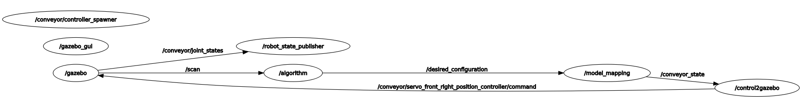

# TurtleBot3 Conveyor

The TurtleBot3 Conveyor is a versatile mobile robot with four wheels and four joints. This GitHub repository provides a comprehensive guide for setting up and moving the Conveyor, covering everything from assembling the robot to programming its movements.


The robot can move thanks to 8 DYNAMIXEL XL430-W250-T servomotors (4 for steering and 4 for driving) connected to an OpenCR1.0 Board. It's possible to communicate with the Arduino board in two ways: via joystick, with the RC100 remote control with BT410 master-slave Bluetooth modules, or via Raspberry Pi 4 using ROS. We're going to explain both.

In this repository, you'll find all the resources you need to get up and running with the TurtleBot3 Conveyor, including software packages, code examples, and documentation. We've also included links to additional resources and tutorials that can help you expand your knowledge and skills.

# Table of Contents

- [Components](#components)

- [Assembly Instructions](#assembly-instructions)

- [Servos' configuration](#servos-configuration)

- [Control Arduino with ROS](#control-arduino-with-ros)

- [Moving the Robot using ROS](#moving-the-robot-using-ros)

- [Other useful files](#other-useful-files)

- [Useful Links](#useful-links)

# Components

To be 3D printed from this [link](https://www.thingiverse.com/thing:3069758)

- 16 x CONVEYOR_ASM_-_WAFFLE_PLATE

- 4  x CONVEYOR_ASM_-_Omni_Cover

- 4  x CONVEYOR_ASM_-_FR12-H101K

Electronic components

- 1 x [OpenCR1.0](http://en.robotis.com/shop_en/item.php?it_id=903-0257-000)

- 1 x [Raspberry Pi 4](https://www.raspberrypi.com/products/raspberry-pi-4-model-b/)

- 1 x [BT-410 SET](https://www.robotis.us/bt-410-set/) Bluetooth Modules

- 1 x [RC-100B](https://www.robotis.us/rc-100b/) Remote Control

- 1 x [LIPO Battery 11.1V 1800mAh LB-012 ](http://en.robotis.com/shop_en/item.php?it_id=903-0210-000) and [LIPO Battery Charger LBC-010](http://en.robotis.com/shop_en/item.php?it_id=903-0144-000)

Motors

- 8 x [XL430-W250-T](http://en.robotis.com/shop_en/item.php?it_id=902-0135-000) Motor

- 4 x [TB3 Wheel/Tire Set](http://en.robotis.com/shop_en/item.php?it_id=903-0260-000)

- 2 x [Robot Cable-X4P 240mm 10pcs ](http://en.robotis.com/shop_en/item.php?it_id=903-0245-000)

Screws

- 64 x M 3x10 mm
- 24 x PH_T 2.5x20mm
- 16 x PH_T 2.6x12 mm K

[Parts of TB3 friends ](https://docs.google.com/spreadsheets/d/1vbIFMRJMbyOd2D6BtwV1Ow_yBc9xRHktqZhTTmwI_l4/edit?pli=1#gid=0)

# Assembly Instructions

## Setup joints (4 pieces)

Fix the FR12-H101K and the Omni_Cover by tightening four screws (PH_T 2.6x12 mm K).


Fasten the Dynamixel onto the FR12-H101K using three screws contained in the servo package.


## Setup wheels (4 pieces)

Mount the tire on the rim. Then fix the wheel to the dynamixel using four screws contained in the motor box.

Remove the black screws, as shown in the picture.


Put two screw nuts in the same place (they are in the Dynamixel box).


## Connect the joints to the wheels

Slide the wheel motor inside the Omni_Cover and fix using two PH_T 2.5x20mm screws. Finally, tighten the black screws we had removed earlier in the holes indicated by the red arrow.


The final result is the following.


## Fix the wheels to the robot body

### Setup the wheels

Fasten the joint onto a WAFFLE_PLATE using screws (PH_T 2.5x20mm). As before, it is first necessary to loosen the black screws and replace them with nuts.


Do the same thing for the bottom plate.


### Assembly of the central body

Fit four WAFFLE_PLATE  together and fix by tightening screws and nuts (M 3x10 mm).


Repeat the same thing to create a second one.

### Fix the wheels to the robot body

Fasten the four wheels onto the central body of the robot using the screws and nuts (M 3x10 mm).

The *final* *result* of this section is the following.


# Servos' configuration

In order to send a signal to the servo we have to assign an ID to it. We set the IDs in this way:

| Servo     | ID  |
| --------- | --- |
| Wheel_L_R | 1   |
| Wheel_R_R | 2   |
| Wheel_L_F | 3   |
| Wheel_R_F | 4   |
| Joint_L_R | 5   |
| Joint_R_R | 6   |
| Joint_L_F | 7   |
| Joint_R_F | 8   |

The first letter after the underscore can be L = LEFT or R = RIGHT.

The second letter after the underscore can be R = REAR or F = FRONT.

Another thing we have to configure is the baud rate of the servo (1 Mbps).

## Configuration's step

First, install the Arduino IDE and the OpenCR board by following this [guide](https://emanual.robotis.com/docs/en/parts/controller/opencr10/).

> Useful chapters
> 
> 1. Introduction
> 
> 2. Specifications
> 
> 3. Layout / Pin Map
> 
>    4.1 Arduino IDE - Install on linux
> 
> 5. Examples
> 
>         5.1 LED
> 
>         5.2 Button
> 
>    8.3 Communication Circuit - TTL Communication

Now it's possible to use the example code of the OpenCR libraries by going to: "File" -> "Examples" -> "OpenCR" -> "Etc" -> "usb_to_dxl". This script allows the OpenCR to communicate with the configuration software.


Install [Dynamixel Wizard 2.0](https://emanual.robotis.com/docs/en/software/dynamixel/dynamixel_wizard2/) configuration software.

We'll repeat this for each motor  we have:

- Plug one motor into the OpenCR board

- Open the Wizard

- Click on "Recovery"
  
  

- Choose the model of the motor (XL430-W250)
  
  

- Choose the firmware version

- Follow the procedure
  
  

- Once we're done, click on "Tools" -> "ID inspections"

- Scan and follow the procedure
  
  

- Click on the model and choose the desired ID
  
  

- Apply

- The last step is changing the baud rate: go to "scan" and start the procedure
  
  

- Change the baud rate to 1 Mbps for each motor, then apply.

## Moving the servos

To begin, we will need to create a Daisy Chain since the OpenCR board only has three TTL ports (you can learn more about this [here](https://github.com/ROBOTIS-GIT/turtlebot3/issues/638)). We connected the board and motors using a Cable-X4P. Additionally, the joints and motors will need an additional power supply. Next, connect the Li-Po battery to the OpenCR.


Connect the RC-100B to the OpenCR plugging the BT-410 master into the controller and the slave into the Arduino board (further information [here](https://emanual.robotis.com/docs/en/parts/communication/rc-100/)).

Then try to move the conveyor by using another example code. It's in: "File" -> "Examples" -> "Turtlebot3" -> "turtlebot3_friends" -> "turtlebot_conveyor". This code allows to use the RC100 remote control to control the robot.


# Control Arduino with ROS

First, we have to install the rosserial_arduino library for ROS to communicate with the Arduino board. You can find installation instructions in this [guide](http://wiki.ros.org/rosserial_arduino/Tutorials/Arduino%20IDE%20Setup).

> Reccomended chapters
> 
>    2.1.1 Installing Binaries on the ROS workstation
> 
>    2.2    Install ros_lib into the Arduino Environment

Next, we need to install the Dynamixel2Arduino library, which can be done by following this [guide](https://emanual.robotis.com/docs/en/software/arduino_ide/) (see chapter 2.1).

Once we have installed these parts we are ready to start. This repo contains some Arduino scripts we wrote that allow communication between ROS and Arduino.

## Moving a wheel

The first script we wrote is contained in TurtlebotConveyor-main\Arduino_code\OneWheel. 
This code makes it possible to turn a motor on or off by sending a message to the 'wheel' topic.

These are the steps we followed:

1. Upload the code into the Arduino board

2. Open a terminal window and start the roscore
   
   ```
   roscore
   ```

3. Open another terminal and launch the script that allows communication
   
   ```
   rosrun rosserial_python serial_node.py /dev/ttyACM0 _baud:=1000000
   ```

4. Send data to the Arduino (open another terminal window)
   
   4.1 Turn on the motor
   
   ```
   rostopic pub wheel std_msgs/Float32 "data:=1.0"
   ```
   
   4.2 Turn off the motor
   
   ```
   rostopic pub wheel std_msgs/Float32 "data:=0.0"
   ```


## Twin wheels

The script we wrote is contained in TurtlebotConveyor-main\Arduino_code\ReadWriteWheels.

In this case, the second wheel is designed as a mimic of the first wheel, copying its movements precisely. We have defined a topic named 'wheel' where the first wheel (we can move manually) publishes its current state, and the second wheel reads the state information and sets itself to the position it reads.

These are the steps we followed:

1. Upload the code into the Arduino board

2. Open a terminal window and start the roscore
   
   ```
   roscore
   ```

3. Open another terminal and launch the script that allows communication
   
   ```
   rosrun rosserial_python serial_node.py /dev/ttyACM0 _baud:=1000000
   ```

4. Move the wheel manually


## Communication Interface

The script we wrote is contained in TurtlebotConveyor-main\Arduino_code\CommunicationInterface.

This code provides a communication interface between ROS and Arduino: it enables the OpenCR board to receive position/velocity commands by reading from topics, and then it sets the commands to the motors accordingly.

These are the steps we followed:

1. Upload the code into the Arduino board

2. Open a terminal window and start the roscore
   
   ```
   roscore
   ```

3. Open another terminal and launch the script that allows communication
   
   ```
   rosrun rosserial_python serial_node.py /dev/ttyACM0 _baud:=1000000
   ```

4. Send data to the Arduino (open another terminal window)
   
   4.1 Set motor velocity (left rear wheel)
   
   ```
   rostopic pub wheel_lr std_msgs/Float32 "data:=100.0"
   ```
   
   4.2 Set joint position (left rear wheel)
   
   ```
   rostopic pub joint_lr std_msgs/Float32 "data:=180.0"
   ```

## Communication Interface using Custom Messages

The previous Arduino script was too onerous to use: we have defined a topic for each motor. The idea of the present code is to use only one ROS topic by using custom ROS messages.

These are the steps we followed:

1. We defined a custom ROS message named *conveyor_state* (see this [guide](http://wiki.ros.org/ROS/Tutorials/CreatingMsgAndSrv#Creating_a_msg)). This file contains information about the desired configuration (position and velocity) the robot must maintain. It's in TurtlebotConveyor\conveyor_description_pkg\msg.
2. We created the *conveyor_state.h* by following this [guide](http://wiki.ros.org/rosserial_arduino/Tutorials/Arduino%20IDE%20Setup#A.28RECOMMENDED.29_Installing_Binaries_on_the_ROS_workstation) (see chapter 2.2).
3. *To make the OpenCR board compile the script, we replace the* ArduinoHardware.h file with [this one](https://github.com/ROBOTIS-GIT/OpenCR/blob/master/arduino/opencr_arduino/opencr/libraries/turtlebot3_ros_lib/ArduinoHardware.h) (this [link](https://github.com/ROBOTIS-GIT/OpenCR/issues/120) is for further information).

We are now ready to upload our new file to Arduino. It's contained in TurtlebotConveyor-main\Arduino_code\CommunicationInterface\CommunicationInterfaceCustom.

This code will be used for further communications.

 It is necessary to run this command after starting the roscore to ensure communication between ROS and Arduino:

```
rosrun rosserial_python serial_node.py /dev/ttyACM0 _baud:=1000000
```

# Moving the Robot using ROS

This part contains some scripts used to control the robot's movement. All these files are contained in TurtlebotConveyor/conveyor_description_pkg/scripts.

## Using keyboard

This code aims to control the robot's movements by using the keyboard.

We have defined three joint configurations to make the robot move forward-backward, rightward-leftward, and rotate.

These are the steps to run the script:

1. Open a terminal window and start the roscore
   
   ```
   roscore
   ```

2. Open another terminal and launch the script that allows communication
   
   ```
   rosrun rosserial_python serial_node.py /dev/ttyACM0 _baud:=1000000
   ```

3. Open another terminal and run the keyboard script
   
   ```
   rosrun conveyor_description_pkg keyboard
   ```

The keys are:

- a: configuration forward/backward
- s: configuration rightward/leftward
- d: rotation
- w: forward/rightward
- q: backward/leftward
- e: stop

This is the result:


## Using the script on Gazebo

It's also possible to run those scripts on Gazebo. Packages conveyor_control and conveyor_description_pkg contain all needed to simulate the robot.

To start the simulation, we have to use this command on the terminal:

```
roslaunch conveyor_description_pkg view_conveyor_gazebo_control.launch
```

Next, start the desired script on another terminal window:

```
rosrun conveyor_description_pkg keyboard
```

Finally, run the script that sends the desired commands to the simulation:

```
rosrun conveyor_control control2gazebo
```

## Using gamepad

This code allows the Logitech F710 Wireless Gamepad to control the robot's movements. 

We modified the [Logitech F710 ROS repository](https://github.com/husarion/logitech_f710_ros/tree/ros1/logitech_f710_ros) to fit our specific use case. The modified code enables the gamepad to send button information via a ROS topic.

To control the robot's movements, we wrote a script that reads from the topic and sends the desired configuration to the robot. The script is contained in TurtlebotConveyor/conveyor_description_pkg/scripts and is named *joystick.cpp*.

To use the gamepad to control the robot, follow these steps:

1. Connect the Logitech F710 Wireless Gamepad to the computer

2. Open a terminal window and use this launch file
   
   ```
   roslaunch logitech_f710_joy_ros joy_teleop.launch
   ```

3. Open another terminal and launch the script that allows communication
   
   ```
   rosrun rosserial_python serial_node.py /dev/ttyACM0 _baud:=1000000
   ```

4. Open another terminal and run the gamepad script
   
   ```
   rosrun conveyor_description_pkg joystick
   ```

The keys are:

- right stick: choose direction
- rb button: move forward

This is the result:


# Other useful files

## conveyor2rviz.launch

The file is located in *TurtlebotConveyor/conveyor_description_pkg/launch* and allows to show the conveyor configuration in RViz by reading the joint state from the Arduino board.

Open a terminal window and use this launch file

```
roslaunch conveyor_description_pkg conveyor2rviz.launch
```

## view_conveyor_gazebo_roam.launch

This file is located in *TurtlebotConveyor/conveyor_description_pkg/launch* and enables the execution and simulation of control algorithms in Gazebo. The default algorithm implemented in this file is one in which the robot moves forward until it encounters an obstacle, at which point it stops and rotates to a new orientation.

To use this launch file, open a terminal window and enter the following command:

```
roslaunch conveyor_description_pkg view_conveyor_gazebo_roam.launch
```

This file enables the execution and simulation of control algorithms in Gazebo. In this instance, the algorithm implemented is one in which the robot moves in a forward direction until it encounters an obstacle, at which point it ceases forward movement and rotates to a new orientation.

This rqt graph shows the nodes and topics related to the conveyor simulation:



To use a different control algorithm, it's possible to modify the file's code by replacing the name of the script that contains the desired algorithm. For example, modify the "algorithm" node in the launch file as follows:

```markup
<!-- Algorithm -->
<node name="algorithm" pkg="conveyor_control" type="roam" />
```

This action will enable the user to execute and simulate the robot's behavior according to the new control algorithm implemented in the script.

## Lidar Configuration

To utilize the lidar, we had to install the LD08 driver by following the instructions listed on the [Robotis website](https://emanual.robotis.com/docs/en/platform/turtlebot3/sbc_setup/#sbc-setup) under section 3.2.8 titled "NEW LDS-02 Configuration". It is crucial to select the appropriate version of ROS beforehand. 

To ensure everything is functioning properly, launch the terminal window and enter the given command.

```
roslaunch ld08_driver ld08.launch
```

# Raspberry

Finally, it is possible to remotely control the robot using a Raspberry Pi 4. The first step is to install the operating system on the Raspberry, using this [guide](https://emanual.robotis.com/docs/en/platform/turtlebot3/sbc_setup/):

Follow chapters 

- 3.2 Configuring the SBC

- 3.2.2 Downloading the image (Raspberry Pi 4B)

- 3.2.3 Unzip the file

- 3.2.4.1 Burn the image file (Raspberry Pi Imager)

- 3.2.5 Resizing the partition (GParted GUI tool)

Remembering to select Noetic as the distribution. The next step is to insert the micoSD into the Raspberry and boot it. To change the connection, just change the SSID and password in /netplan/50-cloud-init.yaml.

Now we are ready to connect to the device. To do this, we use the following command.

```
ssh ubuntu@RaspberryIP 
```

where RaspberryIP is the IP of the Raspberry.

It is possible to get the files to the Raspberry by downloading the repo directly to the device or by transferring it via SSH or USB.  To use SSH, use the following command:

```
scp -r directory/in/my/pc ubuntu@RaspberryIP:catkin_ws/src
```

After running catkin_make in catkin_ws on the Raspberry, we can use the scripts remotely.

To use any launch file or script remotely on raspberry, we must follow these steps on our pc:

1. Connect via SSH to the Raspberry
   
   ```
   ssh ubuntu@RaspberryIP 
   ```

2. Open another terminal and launch a roscore
   
   ```
   roscore
   ```

3. We can run any of the .launch files described above in the window we are connected to via ssh, such as:
   
   ```
   roslaunch conveyor_description_pkg view_conveyor_roam.launch
   ```

To make sure everything is working properly, in addition to observing the robot, we can run *rostopic list* or *rqt_graph* to see that all topics and nodes have been created correctly.

# Useful Links

- [ROBOTIS e-Manual](https://emanual.robotis.com/docs/en/platform/turtlebot3/locomotion/#turtlebot3-friends-conveyor) for Conveyor

- [CAD Conveyor](https://cad.onshape.com/documents/6b16c8df8fc6bb6bcc2182d1/w/2295d0172d536987004f39cd/e/9a71164f03fa8f0764afc11f)

- [rosserial_arduino tutorials](http://wiki.ros.org/rosserial_arduino/Tutorials)
