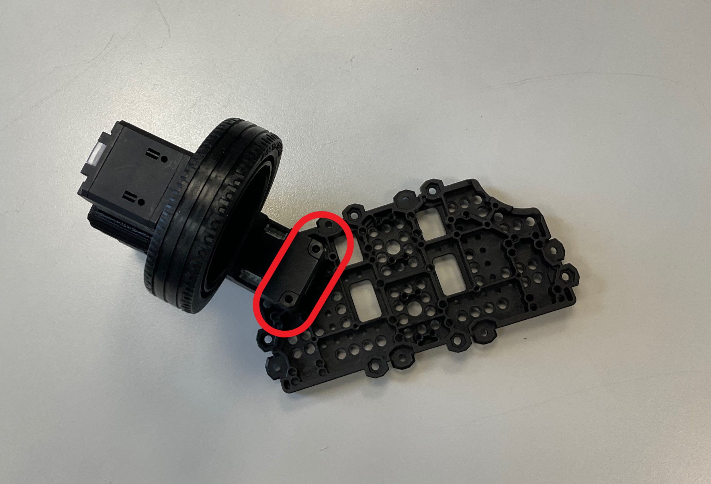

# TurtleBot3 Conveyor

The TurtleBot3 Conveyor is a versatile mobile robot with four wheels and four joints. This GitHub repository provides a comprehensive guide for setting up and moving the Conveyor, covering everything from assembling the robot to programming its movements.

The robot can move thanks to 8 DYNAMIXEL XL430-W250-T servomotors (4 for steering and 4 for driving) connected to an OpenCR1.0 Board. It's possible to communicate with the Arduino board in two ways: via joystick, with the RC100 remote control with BT410 master-slave Bluetooth modules, or via Raspberry Pi 4 using ROS. We're going to explain both.

In this repository, you'll find all the resources you need to get up and running with the TurtleBot3 Conveyor, including software packages, code examples, and documentation. We've also included links to additional resources and tutorials that can help you expand your knowledge and skills. So whether you're new to robotics or an experienced engineer, we hope you'll find this repository to be a valuable resource for your projects and experiments.

# Table of Contents

- [Components](#components)

- [Assembly Instructions](#assembly-instructions)

- [Servos' configuration](#servos-configuration)

- [Useful Links](#useful-links)

# Components

To be 3D printed from this [link](https://www.thingiverse.com/thing:3069758)

- 16 x CONVEYOR_ASM_-_WAFFLE_PLATE

- 4  x CONVEYOR_ASM_-_Omni_Cover

- 4  x CONVEYOR_ASM_-_FR12-H101K

Electronic components

- 1 x [OpenCR1.0](http://en.robotis.com/shop_en/item.php?it_id=903-0257-000)

- 1 x [Raspberry Pi 4](https://www.raspberrypi.com/products/raspberry-pi-4-model-b/)

- 1 x [BT-410 SET](https://www.robotis.us/bt-410-set/) Bluetooth Modules

- 1 x [RC-100B](https://www.robotis.us/rc-100b/) Remote Control

- 1 x [LIPO Battery 11.1V 1800mAh LB-012 ](http://en.robotis.com/shop_en/item.php?it_id=903-0210-000) and [LIPO Battery Charger LBC-010](http://en.robotis.com/shop_en/item.php?it_id=903-0144-000)

Motors

- 8 x [XL430-W250-T](http://en.robotis.com/shop_en/item.php?it_id=902-0135-000) Motor

- 4 x [TB3 Wheel/Tire Set](http://en.robotis.com/shop_en/item.php?it_id=903-0260-000)

- 2 x [Robot Cable-X4P 240mm 10pcs ](http://en.robotis.com/shop_en/item.php?it_id=903-0245-000)

Screws

- 64 x M 3x10 mm
- 24 x PH_T 2.5x20mm
- 16 x PH_T 2.6x12 mm K

[Parts of TB3 friends ](https://docs.google.com/spreadsheets/d/1vbIFMRJMbyOd2D6BtwV1Ow_yBc9xRHktqZhTTmwI_l4/edit?pli=1#gid=0)

# Assembly Instructions

## Setup joints (4 pieces)

Fix the FR12-H101K and the Omni_Cover by tightening four screws (PH_T 2.6x12 mm K).

Fasten the Dynamixel onto the FR12-H101K using three screws contained in the servo package.

## Setup wheels (4 pieces)

Mount the tire on the rim. Then fix the wheel to the dynamixel using four screws contained in the motor box.

Remove the black screws, as shown in the picture.

Put two screw nuts in the same place (they are in the Dynamixel box).

## Connect the joints to the wheels

Slide the wheel motor inside the Omni_Cover and fix using two PH_T 2.5x20mm screws. Finally, tighten the black screws we had removed earlier in the holes indicated by the red arrow.

The final result is the following.

## Fix the wheels to the robot body

### Setup the wheels

Fasten the joint onto a WAFFLE_PLATE using screws (PH_T 2.5x20mm). As before, it is first necessary to loosen the black screws and replace them with nuts.

Do the same thing for the bottom plate.

### Assembly of the central body

Fit four WAFFLE_PLATE  together and fix by tightening screws and nuts (M 3x10 mm).

Repeat the same thing to create a second one.

### Fix the wheels to the robot body

Fasten the four wheels onto the central body of the robot using the screws and nuts (M 3x10 mm).

The *final* *result* of this section is the following.

# Servos' configuration

If you want to send a signal to the servo you have to assign an ID to it. We set the IDs in this way:

| Servo     | ID  |
| --------- | --- |
| Wheel_L_R | 1   |
| Wheel_R_R | 2   |
| Wheel_L_F | 3   |
| Wheel_R_F | 4   |
| Joint_L_R | 5   |
| Joint_R_R | 6   |
| Joint_L_F | 7   |
| Joint_R_F | 8   |

The first letter after the underscore can be L = LEFT or R = RIGHT.

The second letter after the underscore can be R = REAR or F = FRONT.

Another thing you have to configure is the baud rate of the servo (1 Mbps).

## Configuration's step

First, you must install the Arduino IDE and the OpenCR board by following this [guide](https://emanual.robotis.com/docs/en/parts/controller/opencr10/).

> Useful chapters
> 
> 1. Introduction
> 
> 2. Specifications
> 
> 3. Layout / Pin Map
> 
>    4.1 Arduino IDE - Install on linux
> 
> 5. Examples
> 
>         5.1 LED
> 
>         5.2 Button
> 
>    8.3 Communication Circuit - TTL Communication

Now you can use the example code of the OpenCR libraries by going to: "File" -> "Examples" -> "OpenCR" -> "Etc" -> "usb_to_dxl". This script allows the OpenCR to communicate with the configuration software.

Install [Dynamixel Wizard 2.0](https://emanual.robotis.com/docs/en/software/dynamixel/dynamixel_wizard2/) configuration software.

Repeat this for each motor you have:

- Plug one motor into the OpenCR board

- Open the Wizard

- Click on "Recovery"
  
  

- Choose the model of the motor (XL430-W250)
  
  

- Choose the firmware version

- Follow the procedure
  
  

- Once you're done, click on "Tools" -> "ID inspections"

- Scan and follow the procedure
  
  

- Click on the model and choose the ID you want
  
  

- Apply

- The last step is changing the baud rate: go to "scan" and start the procedure
  
  

- Change the baud rate to 1 Mbps for each motor, then apply.

## Moving the servos

To begin, you will need to create a Daisy Chain since the OpenCR board only has three TTL ports (you can learn more about this [here](https://github.com/ROBOTIS-GIT/turtlebot3/issues/638)). You can connect the board and motors using a Cable-X4P. Additionally, the joints and motors will need an additional power supply. Next, you can connect the Li-Po battery to the OpenCR.

Connect the RC-100B to the OpenCR plugging the BT-410 master into the controller and the slave into the Arduino board (further information [here](https://emanual.robotis.com/docs/en/parts/communication/rc-100/)).

Then try to move the conveyor by using another example code. You can find it in: "File" -> "Examples" -> "Turtlebot3" -> "turtlebot3_friends" -> "turtlebot_conveyor". This code allows you to use the RC100 remote control to control the robot.

# Useful Links

- [ROBOTIS e-Manual](https://emanual.robotis.com/docs/en/platform/turtlebot3/locomotion/#turtlebot3-friends-conveyor) for Conveyor

- [CAD Conveyor](https://cad.onshape.com/documents/6b16c8df8fc6bb6bcc2182d1/w/2295d0172d536987004f39cd/e/9a71164f03fa8f0764afc11f)
